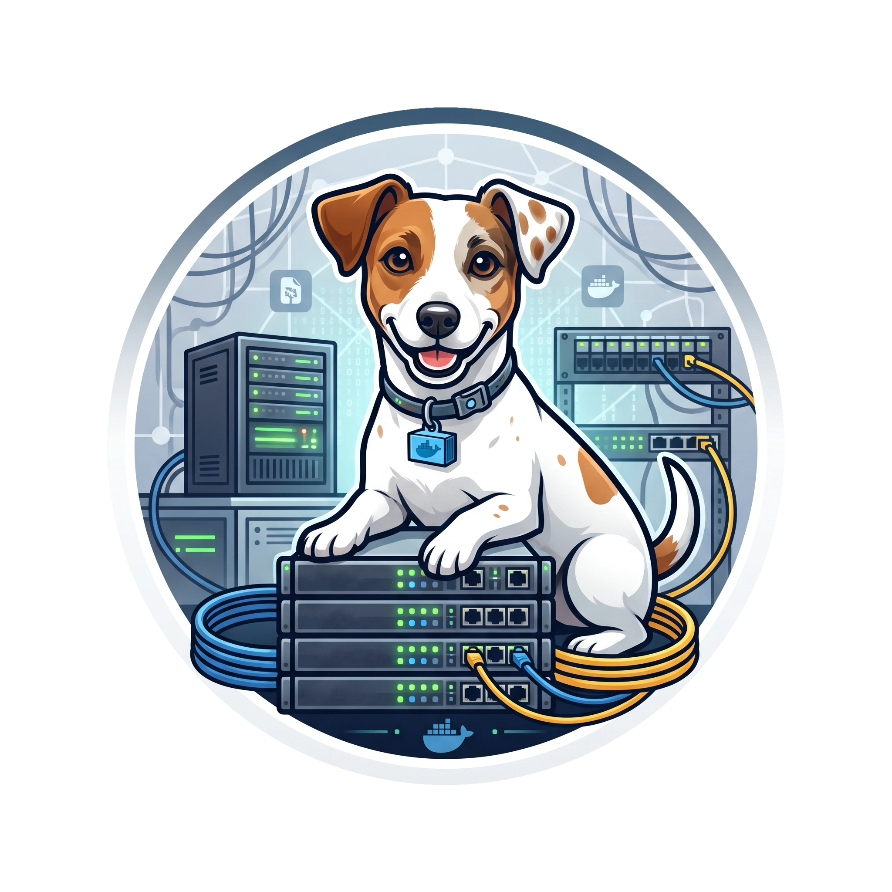

# Maya homelab

  
    
  <em>Meet Maya, the official mascot of this tiny homelab!  I usually pride myself on building and doing everything from scratch, but since I can't even draw a proper square, I had to rely on an LLM prompt to generate this logo.</em> 🥲

  

# Who is Maya?

[Maya](./assets/maya.webp) is my Jack Russell and the inspiration behind the name of this homelab. She's been part of my life long before this little infrastructure project existed, so naming the physical server after her felt only right.
She's also the unofficial supervisor of the entire operation, always nearby, keeping an eye on things and silently judging every questionable infrastructure decision.

 

This repository serves as the architectural blueprint for my simple homelab. It's a collection of my containerized services designed with a singular purpose: **digital sovereignty**.

# Repository Architecture

The repository structure is strictly organizational. Each directory corresponds to a discrete service or a logical grouping of containers. 

*   **Service Directories:** each folder (e.g., `beszel`, `dockhand`) corresponds to a discrete service or a logical grouping of containers. Inside these directories:
    *   `docker-compose.yml`: the declarative configuration defining the service, dependencies, network routing, and persistent volumes.
    *   `.env-example`: a template containing required environment variables for quick deployment.
*   **`archive/`**: a historical vault containing configurations for services that were previously deployed but have since been retired from the active stack to reduce maintenance overhead.
*   **`assets/`**: houses static files, images, and the official Maya logo.
*   **`script/`**: contains automation and utility scripts.

## Services Overview
The current infrastructure runs a diverse stack of applications, categorized by their primary role in the homelab environment.

### Core
*   **Dockhand:** primary Stack Manager. The central configuration and management orchestrator for the homelab, streamlining container deployments and ensuring the infrastructure runs smoothly.
*   **Beszel:** telemetry engine. A highly efficient monitoring daemon that aggregates real time metrics on CPU, memory, and container health, maintaining historical performance data without consuming excessive system resources.
*   **Cloudflare Tunnel:** edge gateway. Securely exposes internal services to the public internet via outbound connections, establishing a zero-trust architecture. This completely bypasses the need for port forwarding, protecting the internal network from external scanning.
*   **Uptime Kuma:** a comprehensive monitoring stack. Uptime Kuma actively tracks the health and response times of all individual homelab services, while Healthchecks acts as a critical "dead man's switch," notifying me immediately if the entire server goes offline.

### Security & Data Integrity
*   **Kopia:** backup orchestrator. It handles zero-knowledge, deduplicated, and end-to-end encrypted snapshots, shipping all homelab data to an offsite Hetzner storage box to ensure rapid disaster recovery against local hardware failures.
*   **Vaultwarden:** lightweight, Rust-based implementation of the Bitwarden API that securely manages credentials and sensitive strings locally, entirely severing reliance on cloud-based password managers.

### Media
*   **Music stack:** a comprehensive, automated ecosystem for music collection and management. While I strongly advocate for [acquiring high-quality music](https://simonemargio.dev/log/navidrome/#music) in ways that support artists, this stack serves as a pragmatic toolchain primarily dedicated to sourcing and archiving albums that are out of print, no longer commercially available, or prohibitively expensive.
    *   **Lidarr:** It excels at keeping the local library meticulously organized, identifying missing albums.
    *   **Prowlarr:** acts as the central indexer manager.
    *   **Slskd:** soulseek client integrated to hunt down rare, underground, or user-shared tracks that traditional indexers miss.
    *   **qBittorrent**: dedicated torrent client exclusively configured to handle peer-to-peer downloads for this stack, keeping I/O operations optimized on the NVMe cache.
*   **Kavita:** digital archival platform. It acts as a highly optimized reading server for ebooks, comics, and manga, featuring a sophisticated metadata engine and seamless cross device synchronization.
*   **Koito:** modern scrobbler. A fast, themeable server to explore listening patterns, track favorite artists, and relay scrobbles to other platforms keeping listening data entirely under my control. You can look at my entire [listening history](https://replay.simonemargio.dev) since I started using Navidrome along with ListenBrainz.
*   **Navidrome:** robust, Subsonic-compatible server that indexes massive local music libraries and streams them with near zero latency to dedicated clients across any device.
*   **qBittorrent:** A containerized torrent client utilized for retrieving and seeding large datasets and distributions.

### Productivity
*   **FreshRSS:** in an era of algorithmic feeds, this service provides deterministic, chronological aggregation of news, blogs, and releases, putting information consumption entirely under my control.
*   **Homelable:** Custom homelab utility and labeling framework tailored for this specific environment.

For further information on the system, configuration, and hardware management, the [Homelab](https://simonemargio.dev/homelab/) webpage is always available.